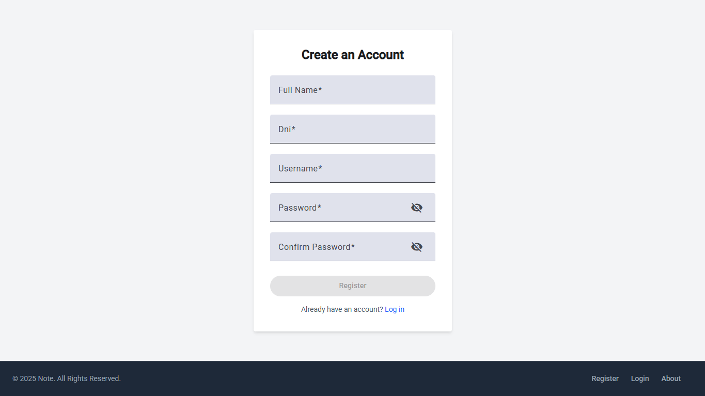
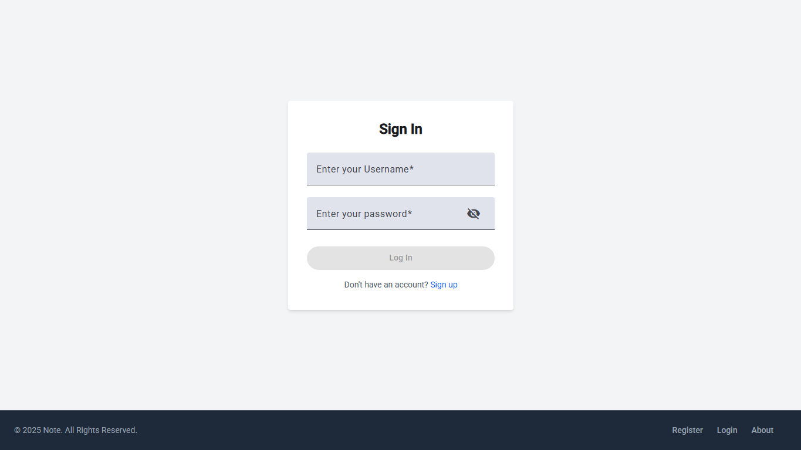
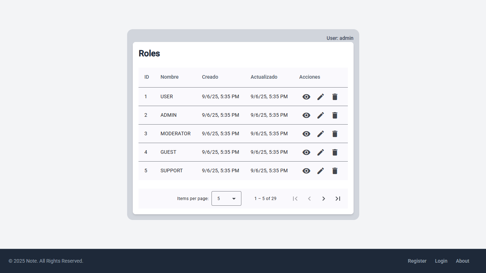
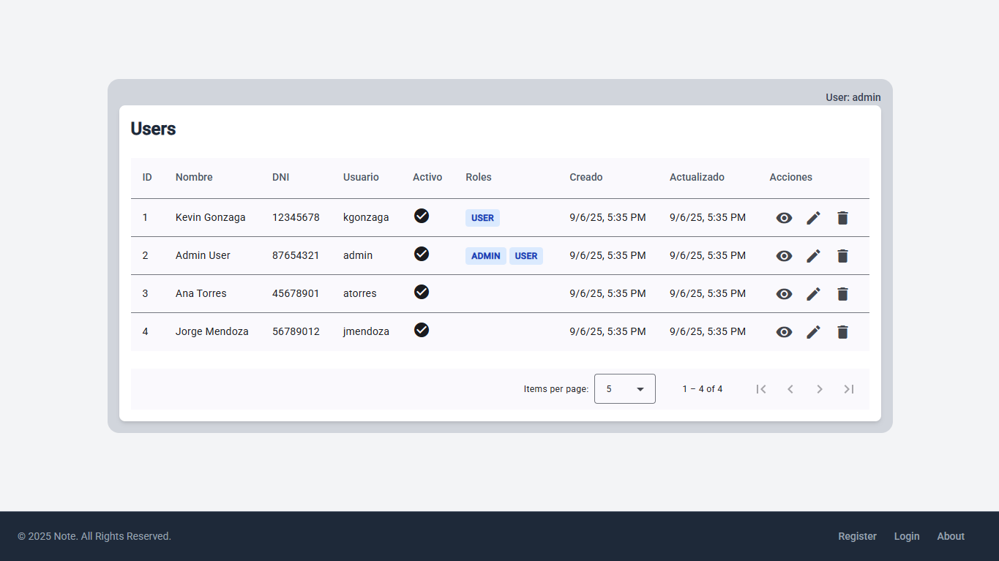
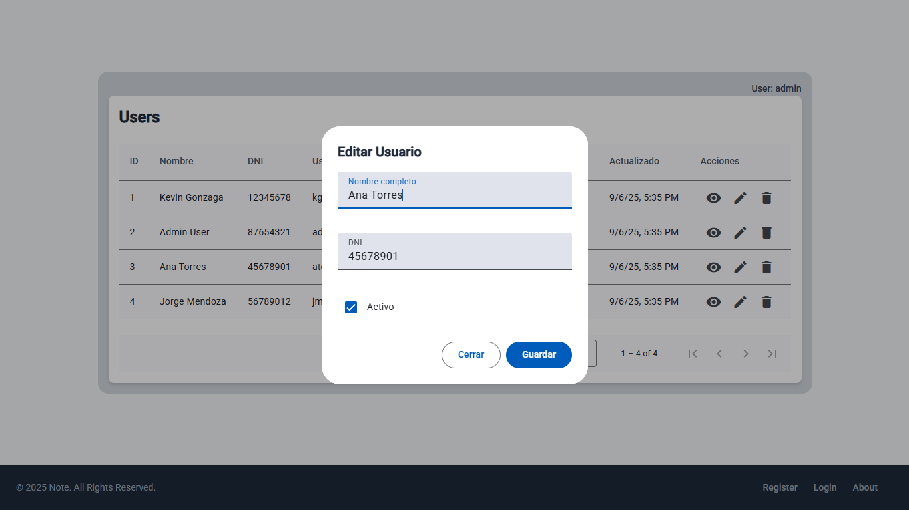
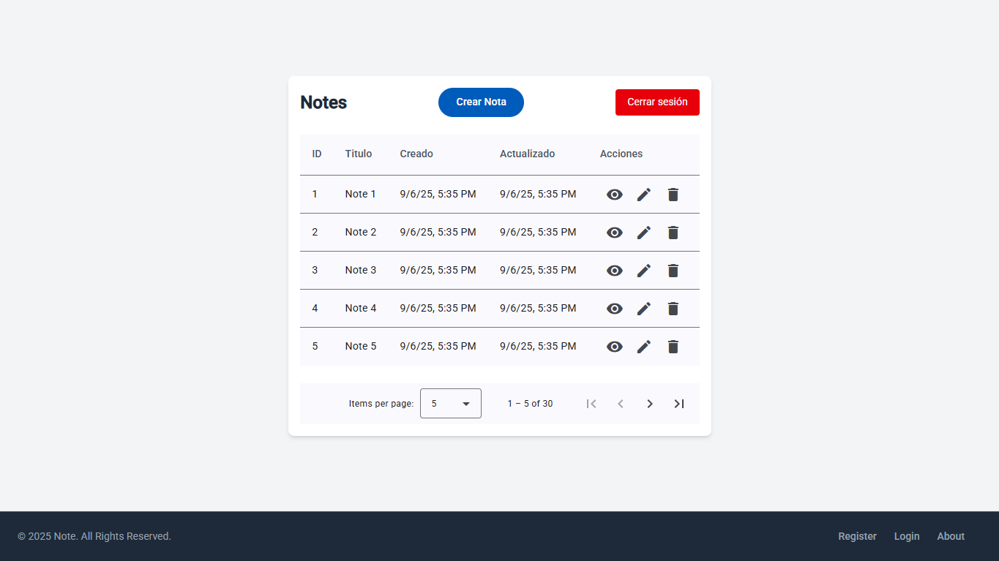

# 🗒️ Note App - Sistema de Gestión de Usuarios, Roles y Notas

**Note App** es un demo de aplicación web desarrollada con **Angular** que permite gestionar usuarios, roles y notas personales. Está diseñada con una arquitectura modular, buenas prácticas de seguridad y una interfaz moderna y responsiva gracias a Angular Material y TailwindCSS.

---

## 🎯Contexto y Propósito

Esta aplicación sirve como base para sistemas administrativos o de gestión de información, donde se requiere autenticación, control de acceso por roles y manejo de datos personales (notas). Es ideal para proyectos que buscan una estructura escalable, reutilizable y fácil de mantener.

---

## 🚀 Características destacadas

- **Autenticación y autorización**: Registro, inicio de sesión y protección de rutas usando JWT y guards personalizados.
- **Gestión de usuarios y roles**: CRUD completo de usuarios y roles, con paginación y diálogos modales para edición y creación.
- **Gestión de notas personales**: Crear, editar, eliminar y listar notas asociadas a cada usuario.
- **Interfaz moderna y responsiva**: Basada en Angular Material y TailwindCSS.
- **Arquitectura modular**: Separación clara de módulos, componentes y servicios.
- **Validaciones avanzadas**: Formularios reactivos con validaciones personalizadas y mensajes de error amigables.

---

## 🧱 Estructura del proyecto

```
src/
│
├── custom-theme.scss           # Tema personalizado para Angular Material
├── index.html                  # Archivo HTML principal
├── main.ts                     # Punto de entrada de la aplicación
├── styles.css                  # Estilos globales y TailwindCSS
│
├── app/
│   ├── app.config.ts           # Configuración principal de la app
│   ├── app.css                 # Estilos globales de la app
│   ├── app.html                # Plantilla principal
│   ├── app.routes.ts           # Definición de rutas principales
│   ├── app.ts                  # Módulo raíz de la aplicación
│   │
│   ├── core/                   # Núcleo de la aplicación (autenticación, guards, servicios base)
│   │   ├── auth/
│   │   │   ├── auth.routes.ts
│   │   │   ├── guards/         # Guards para protección de rutas
│   │   │   │   ├── authenticated.guard.ts
│   │   │   │   ├── is-admin.guard.ts
│   │   │   │   └── not-authenticated.guard.ts
│   │   │   ├── interceptors/   # Interceptores HTTP (manejo de tokens)
│   │   │   │   └── auth-token.interceptor.ts
│   │   │   ├── interfaces/     # Interfaces de datos para autenticación
│   │   │   │   ├── auth-response.ts
│   │   │   │   ├── token-response.ts
│   │   │   │   └── user-request.ts
│   │   │   ├── pages/          # Páginas de login y registro
│   │   │   │   ├── login/
│   │   │   │   │   ├── login.component.html
│   │   │   │   │   └── login.component.ts
│   │   │   │   └── register/
│   │   │   │       ├── register.component.html
│   │   │   │       └── register.component.ts
│   │   │   └── services/
│   │   │       └── auth.service.ts
│   │   └── components/
│   │       ├── footer/
│   │       │   ├── footer.component.html
│   │       │   └── footer.component.ts
│   │       └── header/
│   │           ├── header.component.html
│   │           └── header.component.ts
│   │
│   ├── page/                   # Módulos principales de la aplicación
│   │   ├── page.routes.ts
│   │   ├── dashboard-app/      # Dashboard principal
│   │   │   ├── dashboard-app.component.html
│   │   │   ├── dashboard-app.component.ts
│   │   │   ├── dashboard.routes.ts
│   │   │   ├── role-app/       # Gestión de roles
│   │   │   │   ├── role-app.component.html
│   │   │   │   ├── role-app.component.ts
│   │   │   │   ├── components/
│   │   │   │   │   └── role-dialog/
│   │   │   │   │       ├── role-dialog.component.html
│   │   │   │   │       └── role-dialog.component.ts
│   │   │   │   ├── interface/
│   │   │   │   │   └── role-response.ts
│   │   │   │   └── service/
│   │   │   │       └── role.service.ts
│   │   │   └── user-app/       # Gestión de usuarios
│   │   │       ├── user-app.component.html
│   │   │       ├── user-app.component.ts
│   │   │       ├── components/
│   │   │       │   └── user-dialog/
│   │   │       │       ├── user-dialog.component.html
│   │   │       │       └── user-dialog.component.ts
│   │   │       ├── interface/
│   │   │       │   └── user-response.ts
│   │   │       └── service/
│   │   │           └── user.service.ts
│   │   ├── example/            # Ejemplo de componente adicional
│   │   │   ├── example.component.html
│   │   │   └── example.component.ts
│   │   └── note/               # Gestión de notas personales
│   │       ├── note.component.html
│   │       ├── note.component.ts
│   │       ├── interface/
│   │       │   └── note-response.ts
│   │       ├── note-dialog/
│   │       │   ├── note-dialog.component.html
│   │       │   └── note-dialog.component.ts
│   │       └── service/
│   │           └── note.service.ts
│   │
│   └── shared/                 # Componentes y utilidades compartidas
│       ├── components/
│       │   └── error-alert/
│       │       ├── error-alert.component.html
│       │       └── error-alert.component.ts
│       └── utils/
│           ├── current-year.signal.ts
│           ├── form-utils.ts
│           └── pagination-data.ts
│
└── environments/               # Configuración de entornos
    ├── environment.development.ts
    └── environment.ts
```

---

## 📦 Descripción de los módulos y componentes

- **Autenticación**: Permite a los usuarios registrarse, iniciar sesión y acceder a funcionalidades según su rol. Incluye guards para proteger rutas y un interceptor para añadir el token JWT a las peticiones HTTP.
- **Dashboard**: Vista principal tras autenticarse, con acceso a la gestión de usuarios, roles y notas.
- **Gestión de usuarios**: CRUD de usuarios, con diálogos modales para crear/editar y paginación.
- **Gestión de roles**: CRUD de roles, también con diálogos modales y paginación.
- **Notas personales**: Cada usuario puede gestionar sus propias notas, con interfaz amigable y validaciones.
- **Componentes compartidos**: Header, footer y alertas de error reutilizables en toda la aplicación.
- **Utilidades**: Funciones y signals para validaciones de formularios, paginación y utilidades generales.

---

## ⚙️ Instalación y ejecución

1. **Clona el repositorio:**

   ```sh
   git clone https://github.com/kgonzagao/note-frontend.git
   cd note-app
   ```

2. **Instala las dependencias:**

   ```sh
   npm install
   ```

3. **Ejecuta la aplicación en modo desarrollo:**

   ```sh
   ng serve
   ```

4. **Abre tu navegador en:** [http://localhost:4200](http://localhost:4200)

---

## 📋 Requisitos

- Node.js >= 18
- Angular CLI >= 17
- npm >= 9

---

## ⚖️ Licencia

Este proyecto está bajo la Licencia Apache 2.0.

---

## 🤝 Contribuciones

¡Las contribuciones son bienvenidas! Por favor, abre un issue o un pull request para sugerencias o mejoras.

## 🙌 Créditos y agradecimientos

Este proyecto fue desarrollado como parte del curso de Udemy:

📘 [Angular: De cero a experto - Edición 2025](https://www.udemy.com/course/angular-fernando-herrera/?couponCode=KEEPLEARNING)  
📘 [Angular Pro: Lleva tus bases al siguiente nivel](https://www.udemy.com/course/angular-pro-siguiente-nivel/?couponCode=KEEPLEARNING)  
👨‍🏫 [Instructor: Fernando Herrera](https://www.linkedin.com/in/fernando-herrera-b6b204200/)

---

## 📸 Capturas de la aplicación

### 🟢 Página de registro



### 🔐 Página de login



### 👥 Gestión de roles



### 👤 Gestión de usuarios

  


### 📝 Notas


